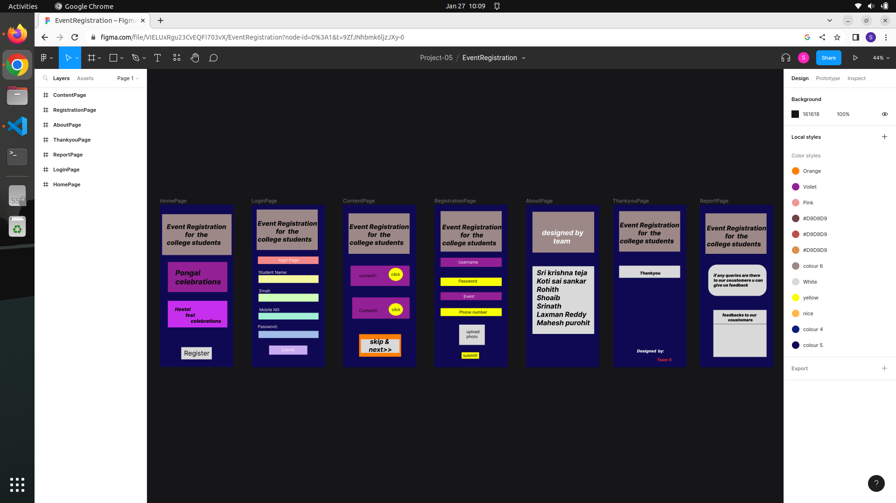

# Event Registration Web Application

## AIM:
To design a web application for event registration.

## DESIGN STEPS:

### Step 1:
use one of the UX application for designing purpose in my case I use figma application which is easy to use

### Step 2:
First creat project file then go inside it and create pages 

### Step 3:
In that page create requried number of frames

### Step 4:
After creating frames then go to design part which is on right side of the screen and select colors and different styles 

### Step 5:
Then assign each frame to your teammates and ask them to design frame as they wanted to do.

### Step 6:

And if something has to add or delete in frame discuss with teammates and then decide.

### Step 6:

After completion of designing go to prototype section and connect frame with other frame in respective order.

## DESIGN:

## Whole Application Design:

## My Design for one frame:
### login page:

## Result:
Thus the web application for event registration is successfully designed.

